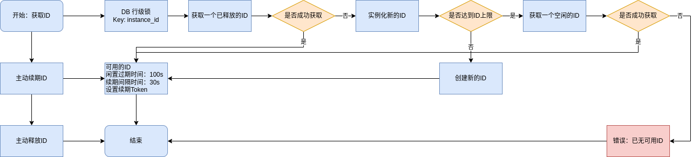

# node id service

**启动服务；启动请检查配置文件；如果使用配置中心，请跳过执行，先阅读`服务配置`部分**

参考配置文件：[config_all.yaml](https://github.com/ikaiguang/go-srv-kit/blob/main/testdata/configs/configs/config_all.yaml)

```shell
# 运行服务
make make run-nodeid-service
# or
go run ./app/nodeid-service/cmd/nodeid-service/... -conf=./app/nodeid-service/configs
```

## 服务配置

* 配置文件：[app.yaml](./app/nodeid-service/configs/app.yaml)

**示例如下：**

```yaml
# app 程序
app:
  server_name: nodeid-service
  # 配置方式；值：local、consul、etcd
  config_method: consul
```

如果`app.config_method`配置是使用配置中心(consul、etcd、...)，首先把配置写入配置中心：

```shell
# 执行
make store-configuration
# or
#* `conf`： 启动读取配置
#* `source_dir`： 被存储的配置文件所在文件夹
#* `store_dir`： 存储到配置中心位置
go run ./app/nodeid-service/cmd/store-configuration/... -conf=./app/nodeid-service/configs \
-source_dir=./app/nodeid-service/configs
-store_dir=
```

## 文档

* api文档swagger [node_id.service.v1.swagger.json](docs/api/node_id.service.v1.swagger.json)

## 流程图


